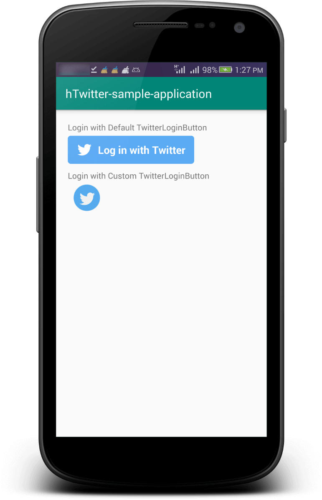
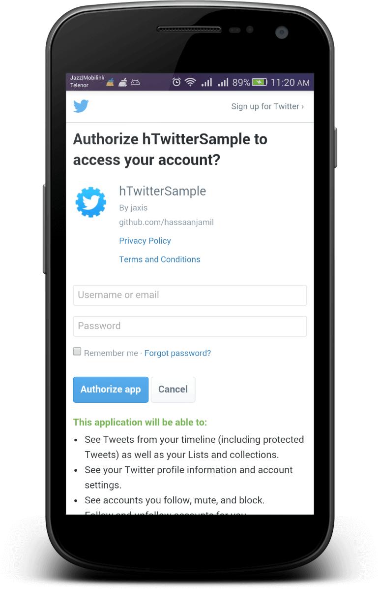

# Twitter Sample Android Application Project + Guide

## Overview
An android sample application project having sample implementation of Login with Twitter through Firebase Authentication, created on August 27, 2019.

> Sample tested with Android Studio 3.4.2

## Sample Application Previews
<p float="left">
 
  
</p>

## To Run this sample code:
You need to:
1. Copy your twitter app's **API Key** and **Secret Key** to the code ([MainActivity.java](https://github.com/hassaanjamil/hTwitterAndroidSampleApplication/blob/master/app/src/main/java/com/hassanjamil/htwitter_sample_application/activities/MainActivity.java)), using Twitter Developer account as instructed in section [Setup Twitter account and creating an app on twitter](https://github.com/hassaanjamil/hTwitterAndroidSampleApplication/blob/master/README.md#setup-twitter-account-and-creating-an-app-on-twitter), and paste here in this code snippet replacing **"YOUR-TWITTER_API_KEY"** & **"YOUR_TWITTER_SECRET_KEY"** sample strings.
```java
    @Override
    protected void onCreate(Bundle savedInstanceState) {
        super.onCreate(savedInstanceState);

        helper = new TwitterHelper(this, this);
        helper.init("YOUR-TWITTER_API_KEY",
                "YOUR_TWITTER_SECRET_KEY");
     }
```
2. Download config file **google-services.json** from firebase and put it to the app module's directory of the sample project, using Firebase Authentication as instructed in section [Firebase configurations for android application - Firebase authentication](https://github.com/hassaanjamil/hTwitterAndroidSampleApplication/blob/master/README.md#setup-twitter-account-and-creating-an-app-on-twitter)
3. Build/Run the Android Sample Project and enjoy! :)

### Setup Twitter account and creating an app on twitter
1. Go to [Twitter Developer Account](https://developer.twitter.com/en/apps)
2. Sign up and request to Twitter for your Developer account
3. When successfully created a developer account you will have a dashboard as screenshot below by clicking the [link](https://developer.twitter.com/en/apps) <br/>

4. Click "Create an app" button to create a twitter application<br/>.

5. Fill your application information required input fields.
6. Check "Enable Sign in with Twitter" option
7. Add callback url **twittersdk://**
8. Add "Tell us how this app will be used field" with your desired description, I have added the description mentioned below:
 "Application will be used only to get twitter user login information to manage user accounts and provide them ease with logging in through twitter in our application."
9. Fill "Terms of Service Url" and "Privacy policy Url" field.<br/>

10. Click "Create" button
11. On success you will get your application page, with readable information as screenshot attached below:<br/>

12. Select "Keys and Tokens", copy API and Secret key and paste somewhere and move towards next section of this guide, and Click "Save"


### Firebase account configurations for android application (Firebase authentication)
1. Go to [Firebase Console](https://console.firebase.google.com/)
2. Click Add Project, name your project, and click Continue.

3. Setup Google Analytics for your project or select "Not now" option and click "Create Project"

4. Wait for sometime firebase is creating your project, when created click "Continue"

5. Choose "Authentication" option under "Develop" section of left-pane, click "Setup Sign-in method" button

6. Under "Sign-in method" method you will find twitter Sign-In provider, enable it and put API Key and Secret Key there in their respective fields
7. Copy the callback url as shown in the screenshot below:

8. Go to Twitter Developer account, choose your app and then under app details tab you will find edit, click edit details, add that copied callback url from firebase project there in twitter app's callback field as shown in the screenshot below:

9. You will get twitter Sign-in provider enabled as shown in the screenshot below:<br/>

10. After Go to Project settings by clicking the gear icon at top-left position on left-pane<br/>

11. Under General Tab, register an app for android through Android Icon as shown in the screenshot<br/>

12. Put your application package name (**com.hassanjamil.hTwitterSample** in this case), nick, and your SHA-1 and Register App as in screenshot below:<br/>

13. After, Download the config file (**google-services.json**) and paste in your app module directory as shown below:<br/>

14. You can have Debug SHA-1 from your android studio, selecting gradle tab, then ":app>>Tasks>>android then right-click on signingReport option and Run the script in console output you will find SHA-1 as shown:<br/>


> You can also integrate twitter in your application project using necessary configurations made in the sample project.
